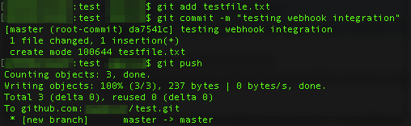

== Adding an API secret after deployment

You can launch this Quick Start without providing an *API Secret* parameter. If your Git service provides an API secret when you create a webhook, you can update the stack with the API secret later.  

To update the stack with an API secret, do the following:

. In the https://console.aws.amazon.com/cloudformation[AWS Cloudformation console], select the stack you want to update.
. In the stack details pane, choose *Update*.
. Choose *Use current template*.
. On the *Specify stack details* page, change the *API Secret* parameter setting, then choose *Next*.
. On the *Configure stack options* page, choose *Next*.
. Choose *I acknowledge that this template may create IAM resources*.
. Choose *Update stack*. When the status is *UPDATE_COMPLETE*, the stack is updated with the API secret.

== Test the deployment

Before putting a webhook into production, test your deployment by doing the following:

. Modify a file in your repository.

:xrefstyle: short
[#testfile]
.Modifying a file
[link=images/testfile.png]

[start=2]
. Commit and push the changes.

:xrefstyle: short
[#commit_push]
.Committing and pushing changes
[link=images/commit_push.png]

[start=3]
. Wait a few minutes, then check your S3 bucket for a new (or updated) object with a key that matches your repository path.

:xrefstyle: short
[#S3_new_object]
.Checking for a new or updated object in your S3 bucket after a commit
[link=images/S3_new_object.png]
image::../images/S3_new_object.png[S3_new_object,width=646,height=348]

== Best Practices

The architecture built by this Quick Start supports AWS best practices for security.

=== SSH Keys

SSH keys are generated when the AWS CloudFormation stack is created. AWS KMS then encrypts the SSH keys and stores them in an S3 bucket. When using the Git pull endpoint, the private SSH key is retrieved from the S3 bucket, decrypted, and used to authenticate your Git service before cloning the repository. 

We don’t recommend sharing SSH keys among multiple services, or launching another instance of this Quick Start for to clone and store another repository in Amazon S3. Each repository should use unique SSH keys.

=== Webhook Security

Git services provide different ways to authenticate against an endpoint. The Git pull endpoint supports webhook secrets (used by GitHub Enterprise, GitLab, and other Git repository managers) and source IP address whitelisting. The .zip download endpoint supports personal access tokens (as used by GitHub Enterprise and GitLab) and OAuth2 (used by Bitbucket). We recommend that you set up at least one of these security mechanisms to protect your webhook API endpoint. 

For more information about how this Quick Start utilizes endpoint security mechanisms, see the link:#parameter_reference[Parameter reference] section of this guide. For product-specific guidance on how to configure these security mechanisms, refer to your Git service documentation.
