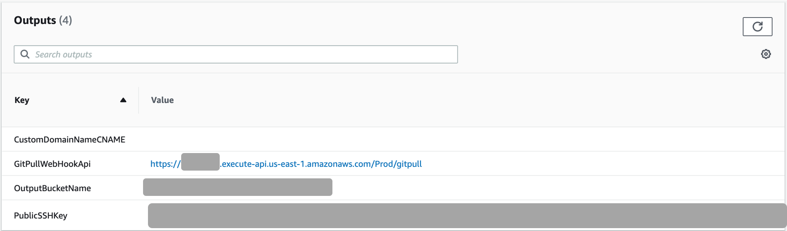
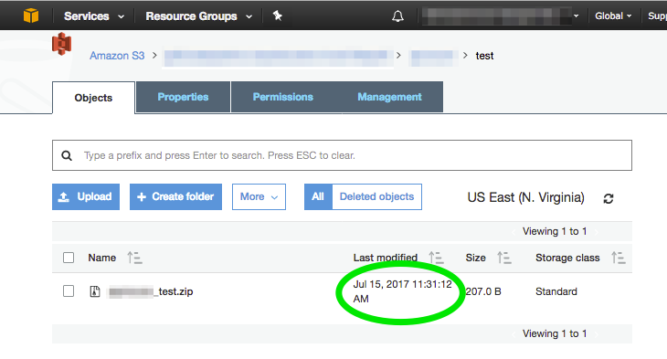

=== Configuring Git services

After deploying the Quick Start, set up a webhook in your Git repository. 

To configure a webhook, you need *GitPullWebHookApi* and *PublicSSHKey*. You can find these on the *Outputs* tab on the AWS CloudFormation console after deploying the Quick Start.

[#outputs_tab]
.Outputs tab on the AWS CloudFormation console
[link=images/outputs_tab.png]


* *GitPullWebHookApi* is the URL endpoint that receives the HTTP POST request from the Git service.
* *PublicSSHKey* is the public SSH key used to connect to your Git repository. This key can be configured as a read-only machine user or as a deployment key in your Git repository.

The instructions for setting up webhooks and deployment keys vary by Git service. For more information, see your Git service documentation.

=== Configuring AWS services

After deploying the Quick Start, configure the AWS services in your workload to use the Git repository S3 bucket as a source. 

As shown in <<outputs_tab>>, the *Outputs* tab in the AWS CloudFormation console includes *OutputBucketName*. This output is an S3 key that forms the base of the path to the .zip file of your repository code. The S3 key is in the following format:

```
S3://output-bucket-name/git-user/git-repository/git-user_git-repository.zip
```
Here, `git-user` is the owner or path prefix of the repository. In some Git services, this may be an organization name. However, some Git services do not return a Git user or organization for a repository. In these cases, you can omit the `git-user` parts of the path.

The instructions for linking an AWS service to an S3 object vary. For links to AWS service documentation, see link:#_aws_services[AWS services] later in this guide.

== Adding an API secret after deployment

You can launch this Quick Start without an *API Secret* parameter. If your Git service provides an API secret when you create a webhook, you can update the stack with the API secret later.  

To update the stack with an API secret, do the following:

. In the https://console.aws.amazon.com/cloudformation[AWS Cloudformation console], select the stack you want to update.
. In the stack details pane, choose *Update*.
. Choose *Use current template*.
. On the *Specify stack details* page, change the *API Secret* parameter setting, then choose *Next*.
. On the *Configure stack options* page, choose *Next*.
. Choose *I acknowledge that this template may create IAM resources*.
. Choose *Update stack*. When the status is *UPDATE_COMPLETE*, the stack is updated with the API secret.

== Test the deployment

Before putting a webhook into production, test your deployment by doing the following:

. Modify a file in your repository.
. Commit and push the changes.
. Wait a few minutes, then check the Git repository S3 bucket this Quick Start deploys for a new (or updated) object with a key that matches your repository path.

:xrefstyle: short
[#S3_new_object]
.Checking for a new or updated object in your S3 bucket after a commit
[link=images/S3_new_object.png]


== Best practices

The architecture built by this Quick Start supports AWS best practices for security.

=== SSH Keys

This Quick Start deploys a private SSH key pair which is encrypted with an AWS KMS key and uploaded to Amazon S3. When invoked by the Lambda function, CodeBuild decrypts the private SSH key and uses it to authenticate your Git service before cloning the repository.

We don’t recommend sharing SSH keys among multiple services, or launching another instance of this Quick Start for to clone and store another repository in Amazon S3. Each repository should use unique SSH keys.

=== Webhook security

Git services provide different ways to authenticate against an endpoint, such as webhook secrets, source IP address whitelisting, personal access tokens, and OAuth2. We recommend that you set up at least one of these security mechanisms to protect your webhook API endpoint. 

For more information about how this Quick Start utilizes endpoint security mechanisms, see the link:#_parameter_reference[Parameter reference] section of this guide. For specific guidance on how to configure security mechanisms for your Git service, refer to your Git service documentation.
