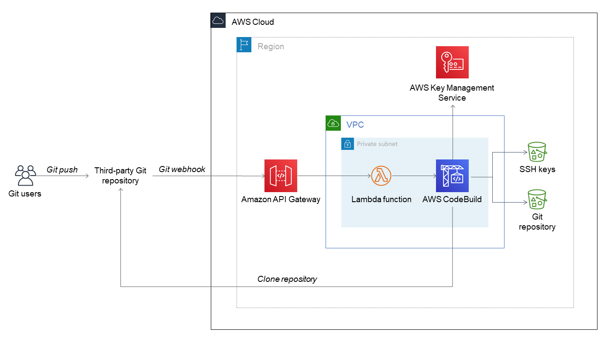

Deploying this Quick Start builds the following environment in the AWS Cloud.

// Replace this example diagram with your own. Send us your source PowerPoint file. Be sure to follow our guidelines here : http://(we should include these points on our contributors giude)

:xrefstyle: short
[#architecture_diagram]
.Git webhooks with AWS services Quick Start architecture
[link=images/architecture_diagram.png]

The Quick Start deployment sets up a serverless AWS Cloud environment that includes the following components:

* Amazon API Gateway to receive Git webhook requests and forward requests to AWS Lambda.
* An AWS Lambda function to process Git webhook requests and invoke AWS CodeBuild.
* AWS Identity and Access Management (IAM) roles required by Lambda and API Gateway. The inline permissions attached to these roles are scoped using the http://docs.aws.amazon.com/IAM/latest/UserGuide/best-practices.html#grant-least-privilege[least privilege] model.
* A CodeBuild project to work with AWS Lambda to connect to the Git service, then retrieve, zip, and upload Git repository code to Amazon Simple Storage Service (Amazon S3).
* AWS Key Management Service (AWS KMS) to encrypt private keys used by AWS CodeBuild to connect to the Git repository using SSH (Secure Shell).
* Two Amazon Simple Storage Service (S3) buckets, one for Git repository contents, and another for the private SSH keys encrypted by AWS KMS. 
* Two Lambda-backed AWS CloudFormation custom resources. One generates an SSH key pair, encrypts it using AWS KMS, and uploads it to Amazon S3. The second deletes the contents of the S3 buckets when you delete the CloudFormation stack. If you need backups, ensure that you copy S3 bucket contents before deleting the stack.

The S3 bucket for Git contents that this Quick Start deploys has versioning enabled, and all previous versions are retained indefinitely. To modify the retention period, see http://docs.aws.amazon.com/AmazonS3/latest/user-guide/create-lifecycle.html[How do I create a lifecycle rule for an S3 bucket?].

== Webhook endpoints
A webhook endpoint is the URL to which your Git service sends HTTP POST requests when commits are pushed to your Git repository.

The following table compares the benefits of the two endpoints deployed by this Quick Start. Use the endpoint that best fits your use case, repository size, and Git workflow.

[cols="1,2,3a"]
|===
Endpoint | Description | Benefits

| Zip download | Use your Git service's HTTP API to download a .zip file of the current version of the entire repository. | 

* No need for external libraries.
* Smaller Lambda function code.
* Large repository size limit (500 MB).

| Git pull | Use SSH to pull, zip, and upload changed files from your Git repository to Amazon S3. |

* Efficient for repositories with a high volume of commits, because each time the API is triggered, it downloads only changed files.
* Suitable for any Git server that supports webhooks and SSH. Does not depend on personal access tokens or OAuth2.
* More extensible because it uses a standard Git library.

|===

NOTE: When configuring a webhook using the Git pull endpoint, you need the the *GitPullWebHookApi* and *PublicSSHKey*. For more information, see link:#_configure_git_services[Configuring Git services] later in this guide.
