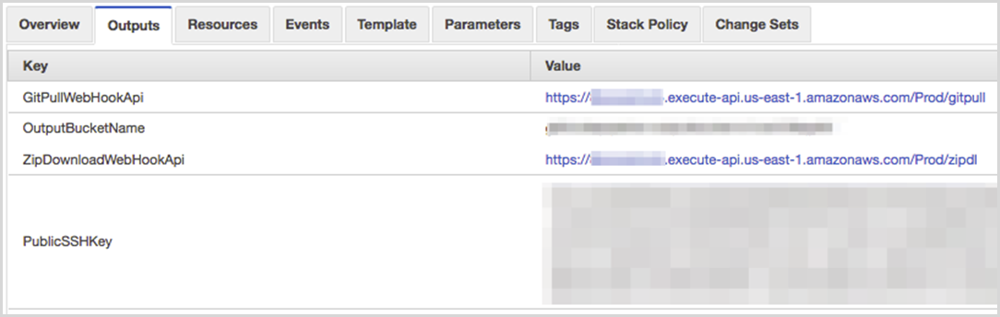

// We need to work around Step numbers here if we are going to potentially exclude the AMI subscription
=== Sign in to your AWS account

. Sign in to your AWS account at https://aws.amazon.com with an IAM user role that has the necessary permissions. For details, see link:#_planning_the_deployment[Planning the deployment] earlier in this guide.
. Make sure that your AWS account is configured correctly, as discussed in the link:#_technical_requirements[Technical requirements] section.

=== Launch the Quick Start

. https://fwd.aws/mDMrd[Launch the AWS CloudFormation template] into your AWS account.

You can also https://fwd.aws/wr8Gg[download the template] to use it as a starting point for your own implementation.

The stack takes approximately 15 minutes to create.

NOTE: You are responsible for the cost of the AWS services used while running this Quick Start reference deployment. There is no additional cost for using this Quick Start. Prices are subject to change. See the pricing pages for each AWS service you will be using in this Quick Start for full details.

[start=2]
. Check the region that’s displayed in the upper-right corner of the navigation bar, and change it if necessary. This is where the network infrastructure will be built. The template is launched in the US East (Ohio) Region by default.
. On the *Select Template* page, keep the default setting for the template URL, and then choose *Next*.
. On the *Specify Details* page, change the stack name if needed. Review the parameters for the template. Provide values for the parameters that require input. For all other parameters, review the default settings and customize them as necessary. When you finish reviewing and customizing the parameters, choose *Next*.
. On the *Options* page, you can https://docs.aws.amazon.com/AWSCloudFormation/latest/UserGuide/aws-properties-resource-tags.html[specify tags] (key-value pairs) for resources in your stack and https://docs.aws.amazon.com/AWSCloudFormation/latest/UserGuide/cfn-console-add-tags.html[set advanced options]. When you’re done, choose *Next*.
. On the *Review* page, review and confirm the template settings. Under *Capabilities*, select the check box to acknowledge that the template will create IAM resources.
. Choose *Create* to deploy the stack.
. Monitor the status of the stack. When the status is *CREATE_COMPLETE*, the webhook resources are ready.
. The *Outputs* tab for the stack contain the two webhook endpoint URLs, the output bucket name, and the public SSH key, as illustrated in Figure 4.

=== Configure Your Git Repository

After you have successfully deployed the Quick Start, you can configure the service that will use the S3 object as a source. Figure 4 shows the *Outputs* tab in the AWS CloudFormation console, which displays the outputs for configuring your Git webhook.

*Figure 4: Outputs tab after deployment*

* *GitPullWebHookApi* is the webhook endpoint to use if you opt for the Git pull method described in the link:#webhook-endpoints[Webhook Endpoints] section of this guide.
// * *ZipDownloadWebHookApi* is the webhook endpoint to use if you opt for the zip download method described in the link:#webhook-endpoints[Webhook Endpoints] section of this guide.
* *PublicSSHKey* is the public SSH key that you use to connect to your repository if you’re using the Git pull endpoint. This key can be configured as a read-only machine user or as a deployment key in your Git service.

The exact process to set up webhooks differs from service to service. For step-by-step instructions, consult your Git service’s documentation.

=== Configure an AWS Service to Connect to the S3 Object

After you have successfully deployed the Quick Start, you can configure the desired service to use the S3 object as a source. As previously illustrated in Figure 4, the *Outputs* tab in the AWS CloudFormation console includes the *OutputBucketName* output. This output is an S3 key that forms the base of the path to your code zip file. The S3 key is in this format:

S3://_output-bucket-name_/_git-user_/_git-repository_/_git-user_git-repository_.zip

where:

* _git-user_ is the owner or path prefix of the repository. In some Git services, this may be an organization name.
* Some Git services do not return a Git user or organization for a repository. In these cases, you can omit the _git-user_ parts of the path.

The exact process for linking an AWS service differs from service to service. For step-by-step instructions, consult the service documentation. For easy reference, here are links for the two typical services:

* http://docs.aws.amazon.com/codepipeline/latest/userguide/tutorials-simple-s3.html[AWS CodePipeline – Simple pipeline tutorial]
* http://docs.aws.amazon.com/codebuild/latest/userguide/getting-started.html[AWS CodeBuild – Walkthrough for creating deployable source code]
