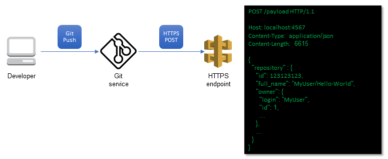

:xrefstyle: short
As <<using_webhooks>> illustrates, when code is pushed to your Git repository, the Git service sends an HTTPS POST request to the endpoints configured by the Quick Start. The POST request contains JavaScript Object Notation (JSON) data about the push operation, including the repository details that the Quick Start uses to fetch the latest version of your code.

[#using_webhooks]
.Using webhooks for code commits
[link=images/using_webhooks.png]

This Quick Start deploys an AWS Lambda function and an AWS CodeBuild project to zip the code in your Git repository and store it in an Amazon Simple Storage Service (Amazon S3) bucket. The deployment provides the code to trigger builds and pipeline executions automatically when you commit changes to a Git repository. With this deployment, your code is continuously integrated, tested, built, and deployed on the AWS Cloud with each change.

NOTE: The AWS CodeBuild Project deployed by this Quick Start must be able to communicate with your Git repository using a Git service. For example, you can use a SaaS-based Git service that AWS CodeBuild can reach through the internet.
